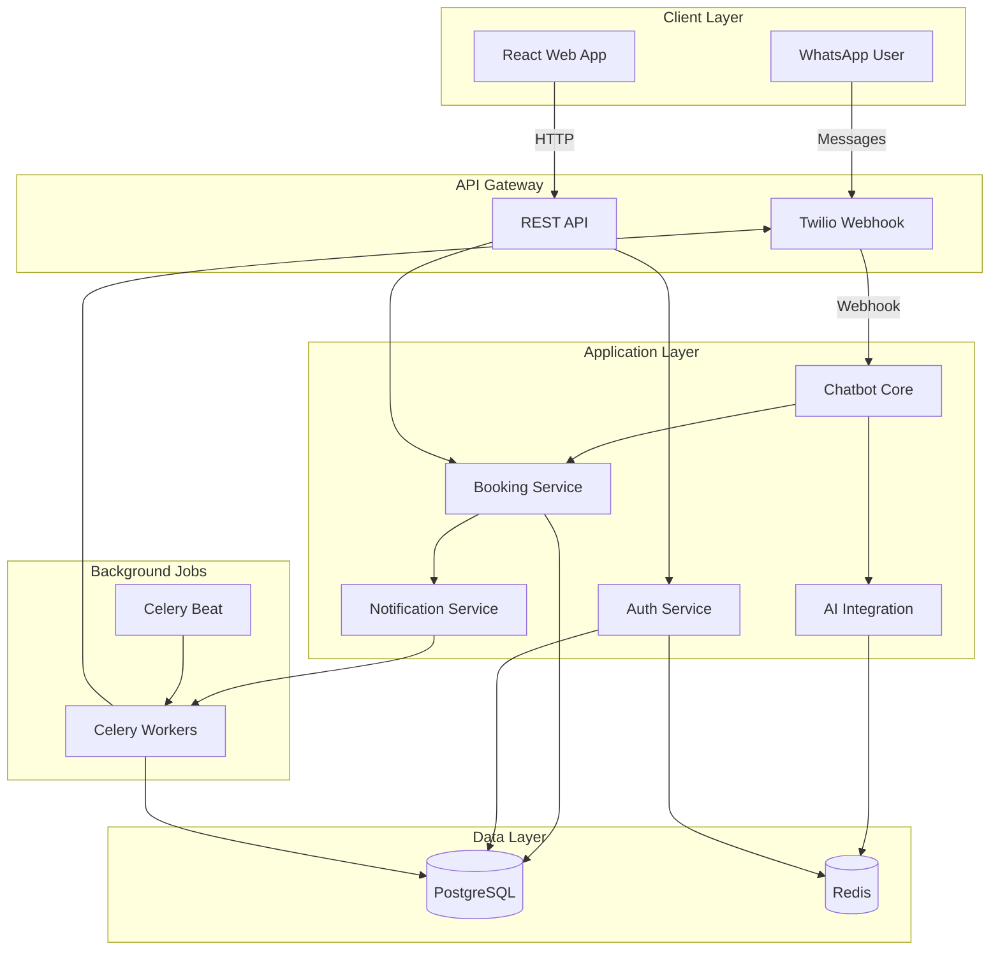
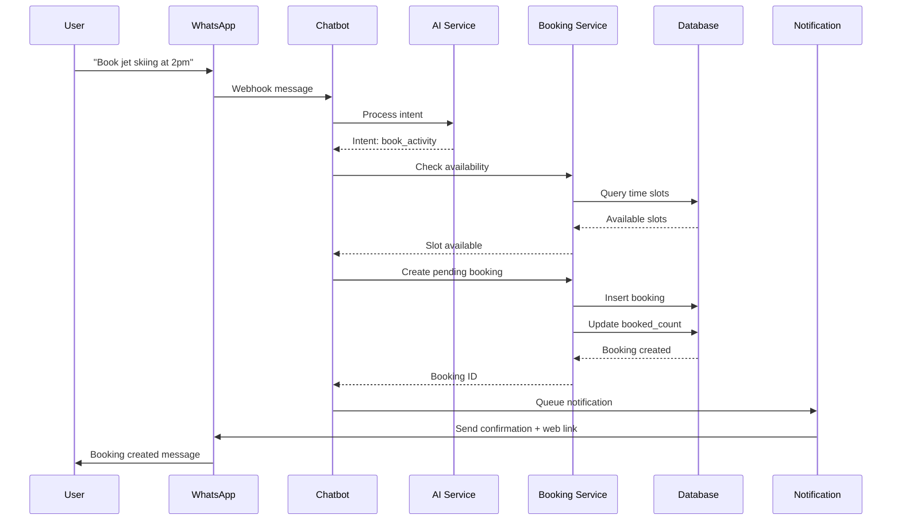
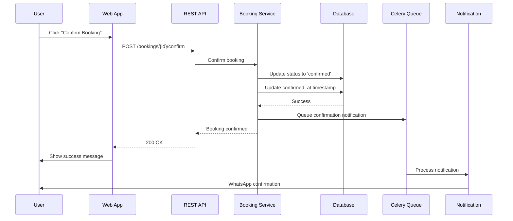

# Design Document

## Overview

The Resort Activity Booking System extends the existing WhatsApp AI chatbot with a comprehensive booking platform for resort activities. The system consists of three main components:

1. **Django Backend**: RESTful API for activity management, booking operations, and business logic
2. **WhatsApp Chatbot Interface**: Conversational booking experience with AI-powered recommendations
3. **React Web Application**: Visual interface for browsing activities and managing bookings

The architecture leverages the existing Django infrastructure (PostgreSQL, Redis, Celery) and integrates seamlessly with the current WhatsApp chatbot implementation.

## Architecture

### High-Level Architecture



### Technology Stack

- **Backend**: Django 5.2, Django REST Framework
- **Database**: PostgreSQL (existing)
- **Cache/Queue**: Redis (existing)
- **Task Queue**: Celery (existing)
- **Frontend**: React 18, TypeScript, TailwindCSS, shadcn/ui
- **UI Components**: shadcn/ui (built on Radix UI primitives)
- **API Communication**: Axios, React Query
- **State Management**: React Context + Hooks
- **WhatsApp**: Twilio API (existing)
- **AI**: OpenAI/OpenRouter (existing)

## Components and Interfaces

### 1. Django Apps Structure

#### New App: `booking_system`

This new Django app will contain all booking-related functionality:

```
booking_system/
├── __init__.py
├── models.py              # Activity, TimeSlot, Booking, UserPreference
├── serializers.py         # DRF serializers
├── views.py               # API viewsets
├── services.py            # Business logic layer
├── tasks.py               # Celery tasks
├── admin.py               # Django admin configuration
├── urls.py                # URL routing
├── permissions.py         # Custom permissions
├── filters.py             # DRF filters
├── validators.py          # Custom validators
└── migrations/
```

### 2. Data Models

#### Activity Model

```python
class Activity(models.Model):
    """Resort activity offering"""
    id = UUIDField(primary_key=True)
    name = CharField(max_length=200)
    slug = SlugField(unique=True)
    description = TextField()
    category = CharField(choices=CATEGORY_CHOICES)  # watersports, spa, dining, etc.
    price = DecimalField(max_digits=10, decimal_places=2)
    currency = CharField(default='USD')
    duration_minutes = IntegerField()
    capacity_per_slot = IntegerField()
    location = CharField(max_length=200)
    requirements = TextField(blank=True)  # Age limits, skill level, etc.
    is_active = BooleanField(default=True)
    created_at = DateTimeField(auto_now_add=True)
    updated_at = DateTimeField(auto_now=True)
    metadata = JSONField(default=dict)  # Flexible additional data
    
    # Indexes for performance
    class Meta:
        indexes = [
            Index(fields=['category', 'is_active']),
            Index(fields=['is_active', '-created_at']),
        ]
```

#### ActivityImage Model

```python
class ActivityImage(models.Model):
    """Images for activities"""
    id = UUIDField(primary_key=True)
    activity = ForeignKey(Activity, related_name='images')
    image = ImageField(upload_to='activities/')
    alt_text = CharField(max_length=200)
    is_primary = BooleanField(default=False)
    order = IntegerField(default=0)
```

#### TimeSlot Model

```python
class TimeSlot(models.Model):
    """Available time slots for activities"""
    id = UUIDField(primary_key=True)
    activity = ForeignKey(Activity, related_name='time_slots')
    start_time = DateTimeField()
    end_time = DateTimeField()
    capacity = IntegerField()  # Can override activity default
    booked_count = IntegerField(default=0)
    is_available = BooleanField(default=True)
    created_at = DateTimeField(auto_now_add=True)
    
    class Meta:
        indexes = [
            Index(fields=['activity', 'start_time']),
            Index(fields=['start_time', 'is_available']),
        ]
        constraints = [
            CheckConstraint(
                check=Q(booked_count__lte=F('capacity')),
                name='booked_count_within_capacity'
            ),
            UniqueConstraint(
                fields=['activity', 'start_time'],
                name='unique_activity_timeslot'
            )
        ]
```

#### Booking Model

```python
class Booking(models.Model):
    """User booking for an activity"""
    STATUS_CHOICES = [
        ('pending', 'Awaiting Confirmation'),
        ('confirmed', 'Confirmed'),
        ('cancelled', 'Cancelled'),
        ('completed', 'Completed'),
        ('no_show', 'No Show'),
    ]
    
    id = UUIDField(primary_key=True)
    user_phone = CharField(max_length=50, db_index=True)
    activity = ForeignKey(Activity, related_name='bookings')
    time_slot = ForeignKey(TimeSlot, related_name='bookings')
    status = CharField(choices=STATUS_CHOICES, default='pending')
    participants = IntegerField(default=1)
    special_requests = TextField(blank=True)
    total_price = DecimalField(max_digits=10, decimal_places=2)
    
    # Timestamps
    created_at = DateTimeField(auto_now_add=True)
    confirmed_at = DateTimeField(null=True, blank=True)
    cancelled_at = DateTimeField(null=True, blank=True)
    expires_at = DateTimeField()  # For pending bookings
    
    # Metadata
    booking_source = CharField(max_length=20)  # 'whatsapp' or 'web'
    metadata = JSONField(default=dict)
    
    class Meta:
        indexes = [
            Index(fields=['user_phone', '-created_at']),
            Index(fields=['status', 'time_slot']),
            Index(fields=['expires_at', 'status']),
        ]
```

#### UserPreference Model

```python
class UserPreference(models.Model):
    """User preferences for AI recommendations"""
    id = UUIDField(primary_key=True)
    user_phone = CharField(max_length=50, unique=True, db_index=True)
    preferred_categories = JSONField(default=list)  # ['watersports', 'spa']
    preferred_times = JSONField(default=list)  # ['morning', 'afternoon']
    budget_range = JSONField(default=dict)  # {'min': 0, 'max': 500}
    interests = TextField(blank=True)  # Free-form text from conversations
    last_updated = DateTimeField(auto_now=True)
    metadata = JSONField(default=dict)
```

### 3. Service Layer

#### BookingService

Handles core booking business logic:

```python
class BookingService:
    """Business logic for booking operations"""
    
    @staticmethod
    def check_availability(activity_id, start_time, participants=1):
        """Check if activity is available at given time"""
        
    @staticmethod
    def create_booking(user_phone, activity_id, time_slot_id, **kwargs):
        """Create a new booking with validation"""
        
    @staticmethod
    def confirm_booking(booking_id, user_phone):
        """Confirm a pending booking"""
        
    @staticmethod
    def cancel_booking(booking_id, user_phone, reason=None):
        """Cancel a booking and release time slot"""
        
    @staticmethod
    def get_user_bookings(user_phone, status=None):
        """Get all bookings for a user"""
        
    @staticmethod
    def expire_pending_bookings():
        """Celery task to expire old pending bookings"""
```

#### RecommendationService

AI-powered activity recommendations:

```python
class RecommendationService:
    """AI-powered activity recommendations"""
    
    def __init__(self, ai_adapter):
        self.ai_adapter = ai_adapter
        
    def get_recommendations(self, user_phone, context=None, limit=3):
        """Get personalized activity recommendations"""
        # 1. Load user preferences
        # 2. Get conversation context
        # 3. Query available activities
        # 4. Use AI to rank and explain recommendations
        
    def update_preferences_from_conversation(self, user_phone, conversation_history):
        """Extract preferences from conversation"""
        
    def explain_recommendation(self, activity, user_preferences):
        """Generate explanation for why activity is recommended"""
```

#### NotificationService

Handles all WhatsApp notifications:

```python
class NotificationService:
    """WhatsApp notification management"""
    
    @staticmethod
    def send_booking_created(booking):
        """Notify user of new pending booking"""
        
    @staticmethod
    def send_booking_confirmed(booking):
        """Notify user of confirmed booking"""
        
    @staticmethod
    def send_booking_cancelled(booking):
        """Notify user of cancellation"""
        
    @staticmethod
    def send_reminder_24h(booking):
        """Send 24-hour reminder"""
        
    @staticmethod
    def send_reminder_1h(booking):
        """Send 1-hour reminder"""
```

### 4. API Endpoints

#### Activity Endpoints

```
GET    /api/v1/activities/                    # List activities
GET    /api/v1/activities/{id}/                # Activity detail
GET    /api/v1/activities/{id}/availability/   # Check availability
GET    /api/v1/activities/categories/          # List categories
GET    /api/v1/activities/search/              # Search activities
```

#### Booking Endpoints

```
POST   /api/v1/bookings/                       # Create booking
GET    /api/v1/bookings/                       # List user bookings
GET    /api/v1/bookings/{id}/                  # Booking detail
POST   /api/v1/bookings/{id}/confirm/          # Confirm booking
POST   /api/v1/bookings/{id}/cancel/           # Cancel booking
```

#### Auth Endpoints

```
POST   /api/v1/auth/request-otp/               # Request OTP
POST   /api/v1/auth/verify-otp/                # Verify OTP
POST   /api/v1/auth/logout/                    # Logout
GET    /api/v1/auth/me/                        # Get current user
```

#### Recommendation Endpoints

```
GET    /api/v1/recommendations/                # Get recommendations
POST   /api/v1/recommendations/feedback/       # Feedback on recommendation
```

### 5. WhatsApp Chatbot Integration

#### Enhanced Message Processor

Extend existing `MessageProcessor` to handle booking intents:

```python
class BookingMessageProcessor:
    """Process booking-related messages"""
    
    INTENTS = {
        'browse_activities': ['show activities', 'what can I do', 'available activities'],
        'book_activity': ['book', 'reserve', 'I want to do'],
        'check_booking': ['my bookings', 'reservations', 'what did I book'],
        'cancel_booking': ['cancel', 'cancel booking'],
        'get_recommendations': ['recommend', 'suggest', 'what should I do'],
    }
    
    def process(self, message, user_phone, conversation_history):
        """Process message and route to appropriate handler"""
        intent = self.detect_intent(message)
        
        if intent == 'browse_activities':
            return self.handle_browse(message, user_phone)
        elif intent == 'book_activity':
            return self.handle_booking(message, user_phone, conversation_history)
        # ... other intents
```

#### Conversation Flow for Booking

```
User: "I want to book a watersport activity"
Bot:  "Great! Here are our available watersports:
       1. Jet Skiing - $80/30min
       2. Parasailing - $120/45min
       3. Snorkeling Tour - $60/2hr
       Which one interests you?"

User: "Jet skiing"
Bot:  "Excellent choice! When would you like to go jet skiing?
       Available times today:
       - 10:00 AM
       - 2:00 PM
       - 4:00 PM"

User: "2pm"
Bot:  "Perfect! I'll book Jet Skiing for 2:00 PM today.
       Price: $80
       Duration: 30 minutes
       
       I've created a pending booking. Please visit [web app link]
       to confirm your booking within 30 minutes."
```

### 6. React Web Application

#### Component Structure

```
src/
├── components/
│   ├── activities/
│   │   ├── ActivityCard.tsx
│   │   ├── ActivityDetail.tsx
│   │   ├── ActivityGrid.tsx
│   │   ├── ActivityFilter.tsx
│   │   └── AvailabilityCalendar.tsx
│   ├── bookings/
│   │   ├── BookingCard.tsx
│   │   ├── BookingList.tsx
│   │   ├── BookingDetail.tsx
│   │   └── BookingActions.tsx
│   ├── auth/
│   │   ├── OTPForm.tsx
│   │   └── PhoneInput.tsx
│   ├── common/
│   │   ├── Button.tsx
│   │   ├── Modal.tsx
│   │   ├── Loading.tsx
│   │   └── ErrorBoundary.tsx
│   └── layout/
│       ├── Header.tsx
│       ├── Footer.tsx
│       └── Navigation.tsx
├── pages/
│   ├── HomePage.tsx
│   ├── ActivitiesPage.tsx
│   ├── ActivityDetailPage.tsx
│   ├── BookingsPage.tsx
│   ├── LoginPage.tsx
│   └── NotFoundPage.tsx
├── hooks/
│   ├── useAuth.ts
│   ├── useActivities.ts
│   ├── useBookings.ts
│   └── useNotifications.ts
├── services/
│   ├── api.ts
│   ├── auth.ts
│   └── storage.ts
├── contexts/
│   ├── AuthContext.tsx
│   └── NotificationContext.tsx
├── types/
│   ├── activity.ts
│   ├── booking.ts
│   └── user.ts
└── utils/
    ├── formatters.ts
    ├── validators.ts
    └── constants.ts
```

#### Key Features

1. **Activity Browsing**
   - Grid/list view toggle
   - Category filtering (using shadcn/ui Select)
   - Price range filtering (using shadcn/ui Slider)
   - Search functionality (using shadcn/ui Input)
   - Image galleries (using shadcn/ui Carousel)

2. **Booking Management**
   - Pending bookings highlighted (using shadcn/ui Badge)
   - One-click confirm/decline (using shadcn/ui Button + AlertDialog)
   - Booking history (using shadcn/ui Card)
   - Status badges (using shadcn/ui Badge)
   - Cancellation with confirmation (using shadcn/ui Dialog)

3. **Authentication**
   - Phone number input with validation (using shadcn/ui Input)
   - OTP verification (using shadcn/ui InputOTP)
   - Session management
   - Auto-logout on expiry (using shadcn/ui Toast for notifications)

4. **Responsive Design**
   - Mobile-first approach
   - Touch-friendly interactions
   - Optimized for WhatsApp in-app browser
   - shadcn/ui components are fully responsive out of the box

## Data Flow

### Booking Creation Flow (WhatsApp)



### Booking Confirmation Flow (Web App)



## Error Handling

### Error Categories

1. **Validation Errors** (400)
   - Invalid phone number format
   - Invalid date/time selection
   - Participants exceed capacity
   - Missing required fields

2. **Authentication Errors** (401/403)
   - Invalid OTP
   - Expired session
   - Unauthorized booking access

3. **Business Logic Errors** (409)
   - Time slot no longer available
   - Booking already confirmed/cancelled
   - Cancellation deadline passed

4. **System Errors** (500)
   - Database connection failures
   - External API failures (Twilio, AI)
   - Unexpected exceptions

### Error Response Format

```json
{
  "error": {
    "code": "SLOT_UNAVAILABLE",
    "message": "This time slot is no longer available",
    "details": {
      "activity_id": "uuid",
      "requested_time": "2025-10-15T14:00:00Z",
      "alternative_slots": [
        "2025-10-15T16:00:00Z",
        "2025-10-15T18:00:00Z"
      ]
    }
  }
}
```

### Retry Strategy

- **WhatsApp Notifications**: Exponential backoff, max 5 retries
- **Database Operations**: Transaction rollback, log and alert
- **External APIs**: Circuit breaker pattern, fallback responses

## Testing Strategy

### Unit Tests

1. **Models**
   - Field validation
   - Model methods
   - Constraints and indexes

2. **Services**
   - Business logic functions
   - Edge cases
   - Error handling

3. **Serializers**
   - Data validation
   - Transformation logic

### Integration Tests

1. **API Endpoints**
   - Request/response validation
   - Authentication/authorization
   - Error responses

2. **Booking Flow**
   - End-to-end booking creation
   - Confirmation/cancellation
   - Concurrent booking scenarios

3. **WhatsApp Integration**
   - Message processing
   - Intent detection
   - Response formatting

### End-to-End Tests

1. **User Journeys**
   - Browse → Book → Confirm (Web)
   - Chat → Book → Confirm (WhatsApp)
   - Cancel booking flow

2. **Cross-Platform**
   - WhatsApp booking → Web confirmation
   - Web browsing → WhatsApp booking

### Performance Tests

1. **Load Testing**
   - Concurrent booking requests
   - Database query performance
   - API response times

2. **Stress Testing**
   - Peak booking periods
   - High message volume
   - Database connection limits

## Security Considerations

### Authentication

- Phone number verification via OTP
- Session tokens with expiration
- CSRF protection for web app
- Rate limiting on OTP requests

### Authorization

- Users can only access their own bookings
- Admin endpoints require staff permissions
- Phone number validation on all booking operations

### Data Protection

- PII encryption at rest (phone numbers)
- Secure session storage
- HTTPS only in production
- CORS configuration for web app

### Input Validation

- Sanitize all user inputs
- Validate phone number formats
- Prevent SQL injection
- XSS protection in web app

## Performance Optimization

### Database

- Indexes on frequently queried fields
- Connection pooling
- Query optimization with select_related/prefetch_related
- Database-level constraints for data integrity

### Caching

- Redis caching for:
  - Activity listings
  - Availability checks
  - User preferences
  - Session data
- Cache invalidation on updates

### API

- Pagination for list endpoints
- Field filtering (sparse fieldsets)
- Response compression
- CDN for static assets

### Background Jobs

- Celery for async operations:
  - Notification sending
  - Booking expiration
  - Reminder scheduling
  - Analytics processing

## Deployment Considerations

### Environment Variables

```
# Booking System
BOOKING_PENDING_TIMEOUT_MINUTES=30
BOOKING_CANCELLATION_DEADLINE_HOURS=24
BOOKING_REMINDER_24H_ENABLED=true
BOOKING_REMINDER_1H_ENABLED=true

# Frontend
REACT_APP_API_URL=https://api.resort.com
REACT_APP_WS_URL=wss://api.resort.com/ws
```

### Database Migrations

- Incremental migrations for zero-downtime deployment
- Backward-compatible schema changes
- Data migration scripts for existing users

### Monitoring

- Application metrics (Prometheus/Grafana)
- Error tracking (Sentry)
- API performance monitoring
- Database query monitoring
- Celery task monitoring

## Future Enhancements

1. **Payment Integration**
   - Online payment processing
   - Deposit requirements
   - Refund handling

2. **Advanced Recommendations**
   - Machine learning models
   - Collaborative filtering
   - Weather-based suggestions

3. **Group Bookings**
   - Multi-user bookings
   - Group discounts
   - Shared booking management

4. **Loyalty Program**
   - Points system
   - Rewards tracking
   - Special offers

5. **Multi-language Support**
   - Internationalization
   - Localized content
   - Currency conversion
